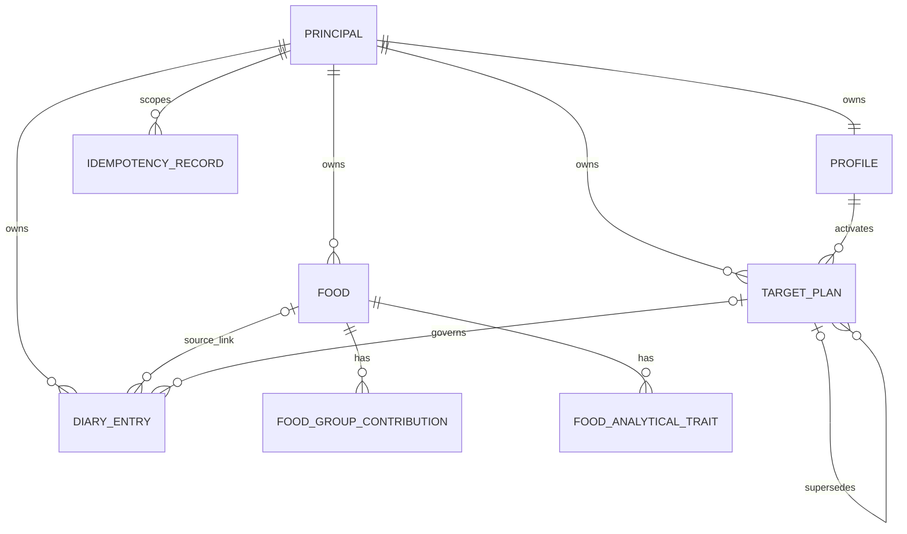

# Wave 1 Physical Data Model

## Artifact Metadata

| Field | Value |
|---|---|
| Artifact ID | `W1-DATA-14` |
| Version | `1.0` |
| Status | `Approved — Engineering and Data` |
| Wave | `Wave 1 — Nutrition & Data Foundation` |
| Owner | Engineering / Data |
| Approver | Engineering / Data |
| Approval date | `2026-07-16` |
| Review evidence | `14A_WAVE1_PHYSICAL_DATA_MODEL_REVIEW.md` |
| Critical findings | `0` |
| High findings | `0` |
| Product Owner decisions remaining | `0` |
| Pinned revision | `afa3a9bb220a7798920d7edc1b0949da15f2d7fe` |
| Implementation authorization | `No` |

## 1. Authority and Scope

This contract translates approved Artifact 13, C01, and H01-H11 into a PostgreSQL design. It does not create models or migrations. Alembic remains the only deployed schema authority. Revisions `0001_initial` through `0003_diary_meal_type` are immutable.

All identifiers are PostgreSQL `uuid`. All timestamps are `timestamptz`, generated by the Backend/database in UTC. Diary and Target Plan calendar boundaries are `date` interpreted through the deployment-configured `Asia/Riyadh` calendar authority.

## 2. Type Policy

- Monetary-style binary floats are prohibited for governed nutrition calculations and persistence.
- Nutrient and calculated values use `numeric`; application adapters expose decimal-safe values.
- Controlled vocabularies use `text` plus named `CHECK` constraints. This permits additive migration sequencing without modifying PostgreSQL enum types in-place.
- Semantic rule versions use `varchar(32)` and must match `^[0-9]+\.[0-9]+\.[0-9]+$`.
- Integer schema versions use `smallint CHECK (value > 0)`.
- Unknown nutrition is `NULL`; explicit zero is numeric `0`.

## 3. Principal and Profile

### `principal`

| Column | Type | Null | Rule |
|---|---|---:|---|
| `id` | `uuid` | No | PK; server-generated UUID |
| `status` | `text` | No | `active`, `disabled`; default `active` |
| `created_at` | `timestamptz` | No | immutable |
| `updated_at` | `timestamptz` | No | Backend-managed |

No credential or bearer token is stored as the Principal key. Credential mapping is an authentication concern, not record ownership.

### Existing `profile` additions

| Column | Type | Null | Rule |
|---|---|---:|---|
| `principal_id` | `uuid` | Expand only | FK `principal(id)`; `ON DELETE RESTRICT`; unique after backfill |
| `cut_intensity` | `numeric(4,3)` | No after backfill | `IN (0.150,0.200,0.250)`; existing rows receive `0.200` |

Existing Profile columns and precision remain unchanged. `UNIQUE (principal_id)` enforces one Profile per Principal. Derived protein basis, BMI, targets, and safety outcomes do not belong on Profile.

## 4. Food

### Existing `food` additions

| Column | Type | Null | Constraint/default |
|---|---|---:|---|
| `principal_id` | `uuid` | Expand only | FK Principal, later required; `ON DELETE RESTRICT` |
| `primary_category_key` | `text` | Yes | approved 19-key vocabulary |
| `food_kind` | `text` | No | `simple`, `composite`, `unknown`; legacy default `unknown` |
| `group_data_status` | `text` | No | `known`, `estimated`, `unknown`; legacy `unknown` |
| `group_data_completeness` | `text` | No | `complete`, `partial`, `unknown`; legacy `unknown` |
| `nutrition_source_type` | `text` | No | approved H07 vocabulary; legacy `unknown` |
| `nutrition_source_name` | `text` | Yes | required by service when type is not `unknown` |
| `nutrition_source_reference` | `text` | Yes | optional |
| `ingredients_text` | `text` | Yes | optional |
| `ingredients_source_type` | `text` | Yes | approved H07 vocabulary |
| `ingredients_source_name` | `text` | Yes | required when ingredient type is known |
| `ingredients_source_reference` | `text` | Yes | optional |
| `nova_classification` | `text` | No | `1`, `2`, `3`, `4`, `unknown`; legacy `unknown` |
| `nova_review_status` | `text` | No | `unreviewed`, `reviewed`; legacy `unreviewed` |
| `selenium_mcg` | `numeric(10,3)` | Yes | `>= 0`; legacy null |
| `iodine_mcg` | `numeric(10,3)` | Yes | `>= 0`; legacy null |
| `folate_dfe_mcg` | `numeric(10,3)` | Yes | `>= 0`; legacy null |
| `vitamin_a_rae_mcg` | `numeric(10,3)` | Yes | `>= 0`; legacy null |

The existing twelve approved exact nutrient columns retain their current numeric types. Together with the four additions, the Wave 1 exact set is: `fiber_g`, `added_sugar_g`, `saturated_fat_g`, `trans_fat_g`, `sodium_mg`, `potassium_mg`, `cholesterol_mg`, `calcium_mg`, `iron_mg`, `magnesium_mg`, `zinc_mg`, `selenium_mcg`, `vitamin_b12_mcg`, `folate_dfe_mcg`, `vitamin_a_rae_mcg`, `iodine_mcg`.

Legacy `category`, `data_source`, `folate_mcg`, and `vitamin_a_mcg` remain readable and nullable. The generic folate/vitamin A fields never populate or satisfy DFE/RAE fields.

Checks enforce nonnegative core and nutrient values, compatible basis (`per_100g` with `unit_basis='g'`; `per_100ml` with `unit_basis='ml'`), and source/NOVA vocabularies. Cross-field source-name and review transitions remain transaction/service validation because partial updates require current row context.

Indexes: `food(principal_id, lower(name))`, `food(principal_id, created_at DESC)`, and `food(principal_id, primary_category_key)`. Duplicate policy is Principal-scoped; no global unique Food-name constraint is introduced.

## 5. Food Group Contributions and Traits

### `food_group_contribution`

| Column | Type | Null | Rule |
|---|---|---:|---|
| `id` | `uuid` | No | PK |
| `principal_id` | `uuid` | No | FK Principal; ownership denormalized for enforceable composite FK |
| `food_id` | `uuid` | No | composite FK `(food_id, principal_id)` to Food; cascade on Food delete |
| `group_key` | `text` | No | approved H06 group vocabulary |
| `subtype_key` | `text` | Yes | allowed only for Registry-defined subtypes |
| `amount_per_100_basis` | `numeric(6,3)` | No | `> 0 AND <= 100` |
| `data_status` | `text` | No | `known`, `estimated` |
| `food_group_rules_version` | `varchar(32)` | No | semantic version |
| `created_at`, `updated_at` | `timestamptz` | No | audit |

Constraints: `UNIQUE(food_id, group_key)` and `UNIQUE(id, principal_id)`. Zero rows are prohibited. A deferred constraint trigger, taking a transaction-scoped advisory lock keyed by `food_id`, verifies the sum of mutually exclusive contributions is `<=100.000` after every insert/update/delete. This makes concurrent total enforcement safe. No remainder is assigned to `other`.

### `food_analytical_trait`

Columns: `id uuid PK`, `principal_id uuid NOT NULL`, `food_id uuid NOT NULL`, `trait_key text NOT NULL`, `food_group_rules_version varchar(32) NOT NULL`, `created_at timestamptz NOT NULL`. Composite owner FK and `UNIQUE(food_id, trait_key)` apply. Approved keys are the eleven H06 traits. Traits never enter contribution sums.

## 6. Hybrid Immutable Target Plan

### `target_plan`

| Column | Type | Null | Rule |
|---|---|---:|---|
| `id` | `uuid` | No | PK |
| `principal_id` | `uuid` | No | FK Principal, `ON DELETE RESTRICT` |
| `profile_id` | `uuid` | No | owner-consistent FK to Profile |
| `status` | `text` | No | `active`, `scheduled`, `closed`, `superseded_before_effective` |
| `effective_from` | `date` | No | inclusive |
| `effective_to` | `date` | Yes | exclusive; greater than start |
| `calendar_timezone` | `varchar(64)` | No | `Asia/Riyadh` for initial release |
| `predecessor_plan_id` | `uuid` | Yes | same-Principal FK |
| `superseded_by_plan_id` | `uuid` | Yes | same-Principal FK |
| `activation_idempotency_key` | `varchar(128)` | No | unique with Principal and operation |
| `calculation_document` | `jsonb` | No | immutable validated document |
| `calculation_document_schema_version` | `smallint` | No | positive |
| `calculation_engine_version` | `varchar(32)` | No | initially `2.0.0` |
| `nutrition_registry_version` | `varchar(32)` | No | initially `1.0.0` |
| `created_at`, `activated_at` | `timestamptz` | No | server audit |
| `closed_at`, `superseded_at` | `timestamptz` | Yes | lifecycle audit |

The calculation document contains authoritative captured Profile inputs, goal/activity, cut request/applied deficit/cap/safety, protein provenance, calorie/macros, carbohydrate warning state, all resolved nutrient targets, custom settings, applicable versions, and schema version. A JSON Schema identified by `calculation_document_schema_version` validates it before persistence.

Immutability is enforced by a database trigger rejecting updates to identity, ownership, effective start, calculation document, and version columns. Only approved lifecycle columns may change.

Constraints:

- `EXCLUDE USING gist (principal_id WITH =, daterange(effective_from,effective_to,'[)') WITH &&) WHERE (status IN ('active','closed'))` prevents effective-period overlap.
- Partial unique index on `principal_id WHERE status='active' AND effective_to IS NULL`.
- Partial unique index on `principal_id WHERE status='scheduled'` permits one pending plan.
- Scheduled plans have null `activated_at`; active/closed plans have non-null activation.
- Superseded-before-effective plans have `superseded_at` and `superseded_by_plan_id`, never become effective, and remain auditable.

## 7. Idempotency Persistence

### `idempotency_record`

Columns: `id uuid PK`, `principal_id uuid NOT NULL FK`, `operation varchar(64) NOT NULL`, `idempotency_key varchar(128) NOT NULL`, `request_hash char(64) NOT NULL`, `state text NOT NULL CHECK IN ('in_progress','completed')`, `response_status smallint NULL`, `response_document jsonb NULL`, `resource_type varchar(64) NULL`, `resource_id uuid NULL`, `created_at timestamptz NOT NULL`, `completed_at timestamptz NULL`, `expires_at timestamptz NOT NULL`.

`UNIQUE(principal_id, operation, idempotency_key)` scopes replay. Completed rows require response fields. Credentials and raw authorization headers are prohibited from hashes/documents. Target Plan activation records are retained at least as long as the plan; routine Food/Diary applicability and retention are finalized by Artifact 15. Cleanup never deletes a record needed to preserve an active request's replay contract.

## 8. Diary Entry and Snapshot v2

Existing `diary_entry` gains:

| Column | Type | Null | Rule |
|---|---|---:|---|
| `principal_id` | `uuid` | Expand only | owner FK, later required |
| `target_plan_id` | `uuid` | Yes | owner-consistent FK, `ON DELETE RESTRICT` |
| `target_provenance` | `text` | No after dual-reader rollout | `versioned_plan`, `legacy_unversioned`, `no_target_source` |
| `snapshot_schema_version` | `smallint` | Yes | null only for validated v1; `2` for v2 |

Existing `food_id` remains nullable with `ON DELETE SET NULL`. Indexes: `(principal_id, entry_date, meal_type, created_at)`, `(principal_id, target_plan_id)`, and owner-consistent composite FKs. Quantity remains `numeric(8,3) CHECK(quantity>0)` and is not copied into v2 values.

### Snapshot v2 JSONB envelope

Required top-level keys are `schema_version`, `food`, `captured_unit`, `nutrition`, `completeness`, `food_groups`, `source`, `nova`, and `versions`.

- `schema_version` is exactly `2`.
- `food` captures source ID when available, name, nullable brand, primary category, and kind.
- `captured_unit` captures nutrition basis, default unit type, unit amount, and unit basis.
- `nutrition` contains calories, protein, carbohydrate, fat, and all 16 exact nutrients per one captured unit. Each additional nutrient is decimal number or null.
- `completeness` preserves resolved known/unknown counts and status.
- `food_groups` contains status, completeness, scaled contribution records, traits, and rules version.
- `source` contains controlled type/name/reference, resolved reliability, and reliability rules version.
- `nova` contains classification, review status, and rules version.
- `versions` contains Registry, food-group, reliability, NOVA, and snapshot schema versions.

JSON numeric values serialize as JSON numbers from decimal-safe server values. Snapshot validation is mandatory before insert. A database check verifies object shape and `schema_version=2`; complete schema validation remains Backend plus contract tests. V1 is recognized only by null relational version plus validated legacy shape. Unknown/malformed versions fail and are never treated as v1 or zero.

Snapshot JSON is immutable. Quantity and meal updates cannot modify it. Food deletion clears only `food_id`; captured identity survives. Target binding never changes except the H08 new-user same-date activation transaction, which changes only relational target fields/provenance for eligible `no_target_source` rows and never snapshot JSON.

## 9. Version Storage Matrix

| Record | Required versions |
|---|---|
| Target Plan | calculation document schema, calculation engine, nutrition Registry; other versions only if governing plan content |
| Snapshot v2 | snapshot schema `2`, nutrition Registry `1.0.0`, food-group `1.0.0`, source-reliability `1.0.0`, NOVA `1.0.0` |
| Legacy Profile/Snapshot v1 | null/unversioned; no backfill |
| Future Analysis | no row/table in Wave 1; analysis version remains reserved/null |

## 10. Ownership and Deletion Matrix

| Parent/action | Result |
|---|---|
| Principal delete | Restricted while any Profile/Food/Diary/Plan exists; account deletion is deferred |
| Profile delete | Restricted while Target Plans exist; account/profile deletion product flow is deferred |
| Food hard delete | Contributions/traits cascade; Diary `food_id` becomes null; snapshots remain immutable |
| Target Plan delete | Prohibited after persistence; lifecycle transition only |
| Diary Entry delete | Owner-scoped hard delete; snapshot removed with entry |
| Idempotency cleanup | Policy-controlled; cannot invalidate required plan replay/audit |

## 11. Legacy Compatibility Matrix

| Legacy data | Wave 1 representation |
|---|---|
| Existing Profile/Food/Diary | Assigned only to explicitly provisioned deployment Principal |
| Existing cut Profile | `cut_intensity=0.200`; no plan fabricated |
| Existing Food category/source | Retained; controlled fields unknown/null |
| Legacy folate/vitamin A | Retained, not converted to DFE/RAE |
| Existing Food classifications | `food_kind/status/completeness/NOVA` unknown/unreviewed; no rows inferred |
| Snapshot v1 | unchanged JSON, null schema version, dedicated validated reader |
| Historical targets | legacy unversioned; no Target Plan fabricated |

## 12. Current-to-Target Delta

| Current baseline | Target delta |
|---|---|
| Global Profile/Food/Diary | Principal table and owner keys/constraints |
| Mutable Profile-derived targets | immutable hybrid Target Plan |
| 12 exact/additional approved fields available | add four exact nullable fields; preserve ambiguous legacy fields |
| Free-text category/source | additive controlled category/source; no inference |
| No groups/traits | normalized owner-scoped child tables |
| Unversioned Snapshot JSON | relational version/provenance/plan link plus v2 envelope |
| No idempotency store | Principal/operation-scoped replay records |
| Implicit local date | persisted Target Plan `Asia/Riyadh` timezone |

## 13. Data Invariants and Enforcement

Database constraints enforce ownership references, cardinality, nonnegative values, contribution uniqueness/totals, plan non-overlap, pending cardinality, and replay uniqueness. Backend transactions enforce controlled transitions, JSON Schema, date authority, Registry compatibility, source-name requirements, plan calculation validity, and authenticated ownership. API schemas reject client-authoritative owner, snapshot, target, provenance, reliability, and version fields. Artifact 20 must test every invariant against PostgreSQL, not SQLite-only fixtures.

## 14. ER Diagram

## 15. Migration, API, and Verification Implications

Artifact 16 must split nullable expansion, explicit Principal provisioning/backfill, row reconciliation, constraints, compatible readers, and writer enablement. Artifact 15 must expose additive contracts without raw JSONB authority. Artifact 20 must prove populated upgrade, two-Principal isolation, constraints under concurrency, v1/v2 readers, no-inference/null semantics, Food deletion safety, plan immutability, idempotency, and schema drift detection.

## 16. Deferred Scope

No registration, account deletion UX, multiple Profiles, public/shared Foods, recipes, direct gram/ml Diary logging, offline storage/sync, Progress UI, Wave 3 analysis, clinical modes, rule administration, or legacy removal is introduced.

## 17. Approval Gate

Artifact 14 cannot authorize implementation. Approval accepts this physical contract for later migration/model implementation only after the whole Freeze Package becomes Frozen.
